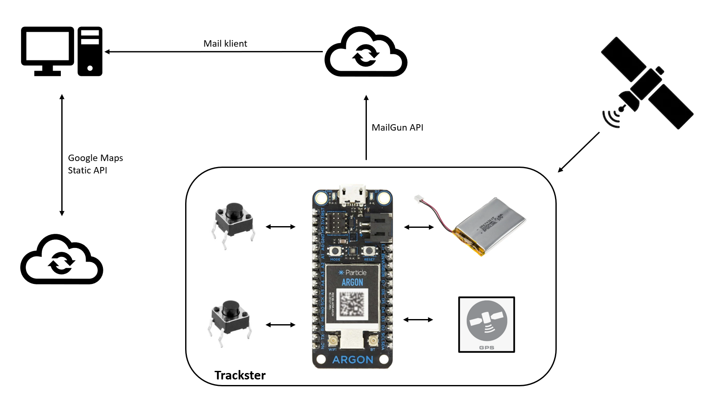
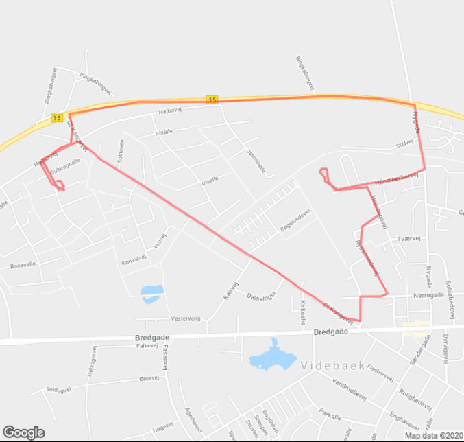

# Trackster
This is an IoT project making a lowpower tracker prototype, for mapping the route traveled.  
When you take the device on a run, at the end of the trip you will receive an email describing the route on a map.  

## Built with:
This project is build with:
- Argon (Particle) - electrical base  
- Adafruit Ultimate GPS - to track user lokation  
- Google maps API - to generate route on map
- Mailgun API - for sending map to user 
- LiPo battery - for powering the device  

## Rich Picture:

## Deployment:
No info until at least something is ready

## Testing
#### Google maps static created from data delivered from Adafruit-GPS:

## Battery discharge

## Authors:
Thomas Serup  
Steffen Breinbjerg
